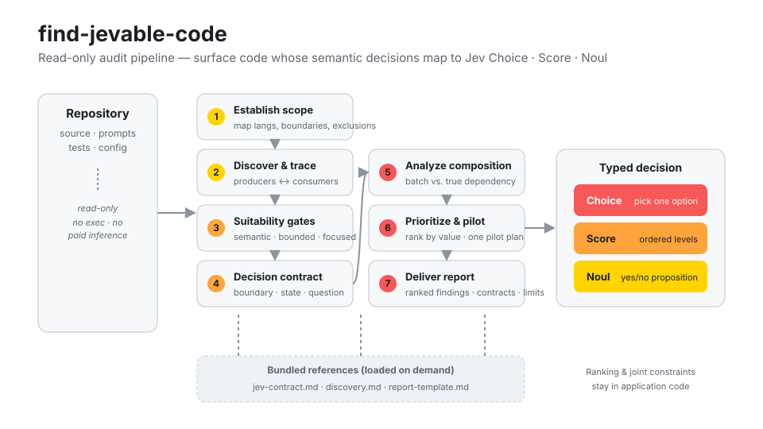

<div align="center">
  
  <h1>jevable-code</h1>
  <p><strong>Find the semantic decisions in a codebase that could become typed Jev questions.</strong></p>

  <p>
    <a href="https://github.com/AltSlate-Labs/jevable-code/actions/workflows/validate.yml"></a>
    
    
    
    
  </p>
</div>

`jevable-code` packages the **find-jevable-code** agent skill. Point it at a
repository and it finds *jevable* code — existing semantic judgments (routing,
triage, relevance, quality, escalation, fuzzy matching) that could be expressed
as a typed **Jev Choice, Score, or Noul** question. It produces ranked,
source-grounded findings with concrete question contracts, batching and
dependency analysis, fallback behavior, and a validation plan — or a defensible
finding that nothing qualifies.

It defaults to **read-only review**: no application code is run, nothing is sent
to Jev, and no paid inference is made just to discover candidates.

## The three primitives it maps to

| Primitive | Model judgment | Typical target |
| --- | --- | --- |
| 🔴 **Choice** | select one supplied option | dispatch, intent, categorization |
| 🟠 **Score** | locate content on ordered levels | severity, quality, relevance |
| 🟡 **Noul** | evaluate one yes/no proposition | flags, matching, escalation signals |

## Architecture

<div align="center">
  
</div>

The skill runs a seven-step read-only pipeline. Discovery searches in both
directions (from model/heuristic **producers** and from the **consumers** of
their results); suitability **gates** reject deterministic logic; each survivor
gets a concrete **decision contract**; composition analysis groups compatible
questions and keeps ranking and joint constraints in application code. The three
bundled references are loaded on demand.

## Install

This one repo works as a skill in **both** Claude Code and Codex — they read the
same `skills/find-jevable-code/SKILL.md`.

**Claude Code** — copy (or symlink) the skill into your skills directory:

```bash
git clone https://github.com/AltSlate-Labs/jevable-code.git
cp -r jevable-code/skills/find-jevable-code ~/.claude/skills/
```

Or install the whole repo as a plugin (`.claude-plugin/plugin.json` is included).

**Codex** — install the plugin; `.codex-plugin/plugin.json` declares the
`./skills/` directory and `agents/openai.yaml` supplies the display name and icon:

```bash
codex skill install https://github.com/AltSlate-Labs/jevable-code.git
```

## Use

From a session with the skill available:

> Use **find-jevable-code** to audit this repository for decisions suited to Jev
> Choice, Score, or Noul, and rank the opportunities with code evidence and
> concrete question contracts.

See [`examples/`](examples/) for a worked end-to-end run: a toy keyword-based
support router ([`support_router.py`](examples/sample-repo/support_router.py))
and the [audit report](examples/audit-report.md) the skill produces for it.

## Layout

```
jevable-code/
├── skills/find-jevable-code/     # the skill (portable across both platforms)
│   ├── SKILL.md                  #   instructions — name + description frontmatter
│   ├── references/               #   jev-contract · discovery · report-template
│   ├── assets/                   #   icon.svg · architecture.svg
│   └── agents/openai.yaml        #   Codex/OpenAI interface metadata
├── examples/                     # worked input + expected audit report
├── test/validate_skill.py        # package validator (run in CI)
├── .claude-plugin/plugin.json    # Claude Code plugin manifest
└── .codex-plugin/plugin.json     # Codex plugin manifest
```

## Develop

Validate the package (frontmatter, links, manifests, grounded examples):

```bash
python3 test/validate_skill.py
```

The same check runs on every push via GitHub Actions.

## License

[MIT](LICENSE) © AltSlate Labs. "Jev" and the Choice/Score/Noul primitives are
referenced as an external decision API; this repository only contains the audit
skill and does not require a Jev API key.
